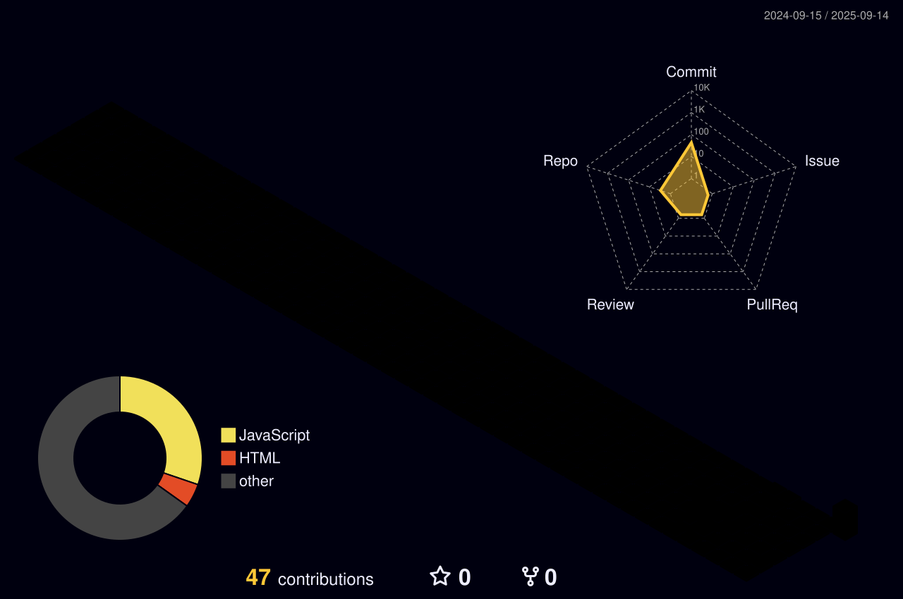

<!--título-->

  <ul align="center">
    
<h1 style="display: inline-block">Isaac Here!</h1>

    
<!--Informaçoes-->

  Hi, I'm Isaac!

  -  I am looking for my first job opportunity. 

<!-- Links -->

**<!-- GIF -->**
**
**
  ****
**
**
  
  <!-- Skills or my habilidades: Tools -->
  

    <h3>Tools</h3>
    
  

---

---

> "Quando se olha muito tempo para um abismo, o abismo olha de volta para você." ~ Nietzsche
